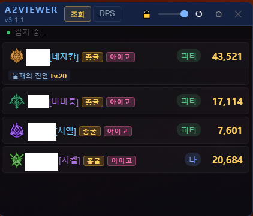
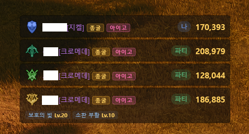
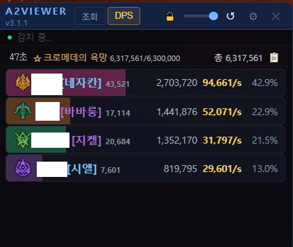
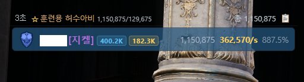

# A2Viewer

아이온2 파티 뷰어 — 패킷 캡처 기반 파티원 전투력 조회 + 실시간 DPS 미터 오버레이

아툴점수조회 패널 노말모드

아툴점수조회 패널 컴팩트모드

DPS미터 패널 노말모드

DPS미터 패널 컴팩트모드

## 설치 및 실행

1. [**A2Viewer.exe 다운로드**](https://github.com/gkrdl/A2Viewer/releases/latest)
2. [Npcap](https://npcap.com/dist/npcap-1.87.exe) 설치 (최초 1회)
3. 아이온2 게임 실행 → 캐릭터 선택 창에서 대기
4. **A2Viewer.exe** 실행 (관리자 권한 자동 요청)
5. 캐릭터 로그인
> 별도 설치 과정 없이 exe 파일 하나로 바로 실행됩니다 (Portable).

## 주요 기능

### 파티원 전투력 조회
- 패킷 캡처로 파티 신청/가입/조회 등 자동 감지
- PlayNC API 기반 전투력 점수 계산 (병렬 조회)
- 스티그마 스킬 추적 (직업별 설정)

### DPS 미터
- 실시간 파티원별 데미지/DPS 집계
- 주 타겟 전용 집계 (비주 타겟 데미지 자동 제외)
- 보스 전환 시 자동 리셋 + 이전 전투 기록 자동 저장
- 액터별 전투시간 기반 공정한 DPS 계산
- 스킬별 상세 통계 (크리티컬/백어택/최소·최대 데미지)
- 최대 50건 전투 기록 열람

### 오버레이
- 게임 위에 항상 표시 (클릭 투과)
- 컴팩트 모드 (카드만 표시)
- 게임 포그라운드 연동 (자동 표시/숨김)
- 투명도 조절, 글씨 크기 조절

### 단축키
| 기능 | 기본값 |
|------|--------|
| 새로고침/DPS리셋 | Alt+1 |
| 숨기기/보이기 | Alt+` |
| 카드만 보기 | Alt+2 |
| 탭 전환 | Alt+3 |

## 요구사항

- Windows 10 이상
- [Npcap](https://npcap.com/) (미설치 시 자동 안내)
- WebView2 Runtime (Windows 10/11 기본 포함)

## 기술 스택

| 구성 요소 | 기술 |
|-----------|------|
| 런타임 | .NET 8 WinForms |
| UI 렌더링 | WebView2 + React |
| 패킷 캡처 | SharpPcap |
| JS 실행 | Jint |

## FAQ

**Q. 파티원이 표시되지 않아요**
A. Npcap이 설치되어 있는지 확인하시고, 캐릭터선택하기 창을 갔다가 다시접속해보세요.

**Q. 게임 실행 중인데 연결이 안 돼요**
A. 앱을 종료 후 다시 실행해보세요. 게임 서버 연결이 완료된 후 자동으로 감지됩니다.

**Q. VPN/프록시 환경에서도 작동하나요?**
A. 네, 프록시/VPN 환경을 자동 감지하여 loopback 캡처 모드로 전환합니다.

## 크레딧

- **[Aion2-Dps-Meter-Packet-Process](https://github.com/HappNJLand/Aion2-Dps-Meter-Packet-Process)** — DPS 미터 패킷 파싱 엔진 (PacketProcessor.dll). 감사합니다!

